# راهنمای کامل پنل Sentinel-FX — به زبان ساده

> این راهنما برای کسی است که ربات را **نصب کرده** و حالا نمی‌داند با پنل چه کند:
> ربات از چه بخش‌هایی ساخته شده، **چطور پیشنهاد معامله بگیرد**، و هر صفحه به چه درد
> می‌خورد. هیچ آشنایی قبلی با برنامه‌نویسی لازم نیست.
>
> عکس‌های این راهنما از **حالت نمایشی** پنل گرفته شده‌اند؛ عددهایشان ساختگی است. پنل شما
> همین شکل را دارد، با عددهای حساب خودتان.

**سه جمله‌ای که قبل از هر چیز باید بدانید:**

1. **ورود به پنل فقط اجازهٔ دیدن می‌دهد.** برای هر کاری که چیزی را تغییر بدهد (تأیید
   معامله، بستن معامله، عوض کردن تنظیم) یک **کد شش‌رقمی تازه** از برنامهٔ Google
   Authenticator گوشی خواسته می‌شود.
2. **ربات در ابتدا خودش معامله نمی‌کند؛ فقط پیشنهاد می‌دهد.** شما پیشنهاد را می‌بینید و
   خودتان «تأیید» یا «رد» می‌کنید.
3. **هیچ رباتی سود را تضمین نمی‌کند.** کار اول این ربات حفظ سرمایه است. اول چند هفته با
   حساب **دمو** (پول غیرواقعی) کار کنید.

---

## فهرست

1. [ربات در یک نگاه: از چه بخش‌هایی ساخته شده؟](#part-1)
2. [ورود به پنل و کد دومرحله‌ای](#part-2)
3. [آشنایی با ظاهر پنل](#part-3)
4. [**چطور پیشنهاد معامله بگیرم؟ (مهم‌ترین بخش)**](#part-4)
5. [چهار حالت کار ربات](#part-5)
6. [شبیه‌ساز، دمو یا پول واقعی؟ و وصل کردن آلپاری](#part-6)
7. [صفحه‌به‌صفحه: همهٔ بخش‌های پنل](#part-7)
8. [کارهای روزانه و هفتگی](#part-8)
9. [مشکلات رایج و راه حل](#part-9)
10. [چند واژهٔ ضروری](#part-10)
11. [کارهایی که هرگز نباید بکنید](#part-11)

---

<a id="part-1"></a>

## ۱. ربات در یک نگاه: از چه بخش‌هایی ساخته شده؟

ربات را مثل یک **تیم کوچک** تصور کنید که هر **۶۰ ثانیه** یک بار دور هم جمع می‌شوند و
کارهای زیر را به ترتیب انجام می‌دهند:

**۱. دیدبان — «قیمت‌ها چند است؟»**
قیمت پنج جفت‌ارز اصلی (`EUR_USD`، `GBP_USD`، `USD_JPY`، `AUD_USD`، `USD_CHF`) را می‌گیرد.
اگر متاتریدر وصل باشد، از **بروکر شما** (مثلاً آلپاری)؛ اگر نه، از **شبیه‌ساز داخلی** که
قیمت‌های ساختگی می‌سازد (بخش ۶ را ببینید).

⬇

**۲. هواشناس — «حال‌وهوای بازار چطور است؟»**
بازار را برچسب می‌زند: جهت‌دار، آرام، پرنوسان یا بحرانی. هر استراتژی فقط در بعضی از این
حالت‌ها جواب می‌دهد.

⬇

**۳. شکارچی‌ها (استراتژی‌ها) — «فرصتی هست؟»**
سه استراتژی از اول روشن‌اند و هر سه روی **کندل‌های ۴ ساعته (H4)** کار می‌کنند:

| نام در پنل | به زبان ساده چه می‌کند |
|---|---|
| `donchian_trend` | وقتی قیمت از بالاترین (یا پایین‌ترین) قیمت چند روز اخیر رد شود و بازار جهت‌دار باشد، هم‌جهت با آن معامله می‌کند |
| `ma_cross_atr` | وقتی میانگین کوتاه‌مدت قیمت، میانگین بلندمدت را قطع کند (نشانهٔ عوض شدن جهت) |
| `inside_bar_break` | وقتی بعد از یک کندل «آرام» (کندلی که کاملاً داخل کندل قبلی است)، قیمت از آن بیرون بزند، هم‌جهت با روند |

هر سه هنوز در مرحلهٔ **«فقط یک ایده»** هستند: یعنی روی حساب تمرینی و دمو اجازهٔ کار
دارند، ولی **اجازهٔ معامله با پول واقعی ندارند** تا وقتی آزمون‌ها را بگذرانند.

⬇

**۴. فیلترها و مغز ربات — «این فرصت ارزشش را دارد؟»**

- **مغز ربات (یادگیری):** از همهٔ سیگنال‌های گذشته یاد گرفته؛ می‌تواند حجم را کم کند، بعد
  از چند ضرر پشت سر هم «استراحت اجباری» بدهد، یا فرصت ضعیف را رد کند.
- **فیلتر دوم:** یک مدل آماری که می‌پرسد «این سیگنال را بگیرم یا نه؟».
- **دلار و COT:** اگر دلار آمریکا خلاف معامله قوی باشد، یا معامله‌گران بزرگ بیش از حد یک
  طرف ایستاده باشند، حجم را کم می‌کند.
- **خبرها:** نزدیک خبرهای مهم اقتصادی معامله نمی‌کند.

> هیچ‌کدام از این‌ها **نمی‌تواند حجم را بزرگ‌تر کند یا یک قاعدهٔ ایمنی را خاموش کند.** فقط
> می‌توانند ربات را **محتاط‌تر** کنند.

⬇

**۵. نگهبان ریسک — «اجازه داریم؟»**
بیش از ۵۰ قاعدهٔ ایمنی که از قبل نوشته و قفل شده‌اند. چند نمونه:

- در هر معامله حداکثر **۰٫۵٪** حساب در خطر باشد (روی حساب ۱۰۰۰ دلاری یعنی ۵ دلار).
- اگر امروز **۲٪** ضرر کرده‌ایم، تا فردا معاملهٔ تازه نه (هفته‌ای ۴٪، ماهی ۶٪).
- اگر حساب **۱۰٪** از بالاترین مقدارش پایین آمد، ربات کاملاً متوقف می‌شود.
- حد ضرر **اجباری** است و باید **نزد خود بروکر** ثبت شود.
- حداکثر ۶ معامله در روز؛ فقط در ساعت‌های مجاز؛ نه نزدیک خبر مهم؛ نه وقتی اختلاف قیمت
  خرید و فروش زیاد است؛ و ...

اندازهٔ معامله (لات) را هم همین بخش حساب می‌کند، طوری که اگر حد ضرر خورد، فقط همان ۰٫۵٪
از دست برود.

⬇

**۶. تصمیم نهایی — «ربات اجرا کند یا از شما بپرسد؟»**
به **حالت کار ربات** بستگی دارد (بخش ۵). در حالت پیش‌فرض، **«فقط پیشنهاد»**، ربات فرصت
را برای **شما** می‌فرستد و منتظر می‌ماند.

⬇

**۷. اجراکننده — «سفارش را بفرست»**
اگر شما تأیید کردید (یا ربات خودکار است)، سفارش را همراه **حد ضرر** و **حد سود** به
متاتریدر می‌فرستد و بعد مطمئن می‌شود واقعاً ثبت شده است.

⬇

**۸. محافظ معاملهٔ باز — «سود را نگه دار»**
وقتی معامله باز است:

- اگر سود به اندازهٔ مبلغ ریسک‌شده رسید، حد ضرر را به **نقطهٔ ورود** می‌برد (دیگر ضرر
  نمی‌کند).
- در سود ۱٫۵ برابر، **بخشی** از معامله را می‌بندد.
- حد ضرر را همراه سود جلو می‌برد (**حد ضرر دنبال‌کننده**).
- **پیش از تعطیلی آخر هفته** همه را می‌بندد.
- اگر سود امروز به **۳٪** حساب رسید، بقیهٔ روز معاملهٔ تازه باز نمی‌کند.

**و کنار همهٔ این‌ها:**

| بخش | کارش |
|---|---|
| **کلید توقف اضطراری** | با یک دکمه، ربات هیچ معاملهٔ تازه‌ای باز نمی‌کند. خودش هرگز خاموش نمی‌شود؛ فقط شما برش می‌دارید |
| **نگهبان ضربان** | برنامه‌ای جدا که اگر ربات ۳ دقیقه جواب ندهد، توقف اضطراری را روشن می‌کند |
| **نگهبان متاتریدر** | اگر متاتریدر بسته شد، قفل کرد یا قطع شد، دوباره بازش می‌کند و وصلش می‌کند |
| **نگهبان عملکرد** | استراتژی‌ای که بعد از ۵۰ معامله آشکارا ضررده است را معلق می‌کند |
| **حافظه و آزمایشگاه شبانه** | هر شب همهٔ استراتژی‌ها را دوباره می‌سنجد؛ هر هفته گزارش می‌دهد |
| **دستیار هوش مصنوعی** (اختیاری) | خبر می‌خواند، معامله‌های بسته را توضیح می‌دهد، گزارش روزانه می‌نویسد. **حق تصمیم‌گیری ندارد** |
| **اعلان‌ها** (اختیاری) | پیام‌ها را به **تلگرام** یا **بله** می‌فرستد |
| **دفتر ثبت رویدادها** | هر کاری که ربات یا شما کرده‌اید را غیرقابل دستکاری ثبت می‌کند |

---

<a id="part-2"></a>

## ۲. ورود به پنل و کد دومرحله‌ای

### ورود

1. روی همان کامپیوتری که ربات نصب است، مرورگر (کروم یا فایرفاکس) را باز کنید.
2. بنویسید: **`http://127.0.0.1:8088`**
3. نام کاربری: **`owner`** — رمز: رمزی که موقع نصب داده شد (یا رمزی که بعداً گذاشتید).

> پنل عمداً فقط روی **همان کامپیوتر** باز می‌شود. این امن‌ترین حالت است: پنلی که می‌تواند
> پول جابه‌جا کند نباید روی اینترنت باز باشد.

### کد دومرحله‌ای (Google Authenticator)

هر کاری که چیزی را تغییر بدهد، این پنجره را باز می‌کند:

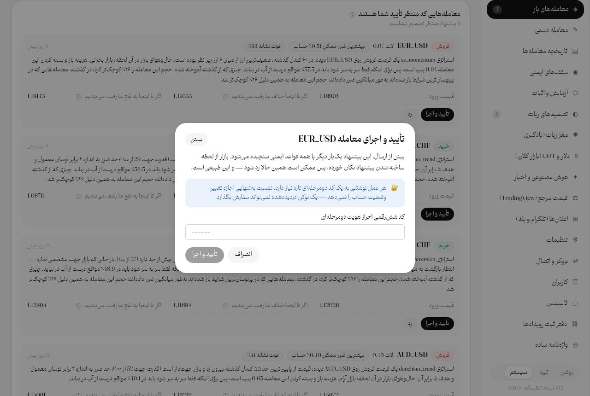

- کد **شش‌رقمی** را که **همان لحظه** در برنامهٔ Google Authenticator گوشی (زیر نام
  Sentinel-FX) نشان داده می‌شود بنویسید و **«تأیید و اجرا»** را بزنید.
- هر کد فقط **یک بار** قبول می‌شود. برای کار بعدی، صبر کنید کد عوض شود (هر ۳۰ ثانیه).
- اگر کد قبول نشد، تقریباً همیشه **ساعت** کامپیوتر یا گوشی درست نیست. هر دو را روی «تنظیم
  خودکار ساعت» بگذارید.

### سه قانون که باید بدانید

| قانون | یعنی چه | چه کنید |
|---|---|---|
| **هر ورود ۳۰ دقیقه اعتبار دارد** | ۳۰ دقیقه بعد از ورود (حتی اگر کار کرده باشید) نشست تمام می‌شود و پیغام `401: invalid or expired session` می‌آید | کلید **F5** را بزنید و دوباره وارد شوید |
| **۵ بار کد یا رمز اشتباه = ۱۵ دقیقه قفل** | بعد از ۵ اشتباه، حساب ۱۵ دقیقه قفل می‌شود و از پنل بیرون می‌افتید. قفل‌های بعدی طولانی‌ترند | ۱۵ دقیقه صبر کنید. قبلش ساعت گوشی و کامپیوتر را درست کنید |
| **هر بار ری‌استارت ربات، همه بیرون می‌افتند** | بعد از روشن و خاموش شدن کامپیوتر یا ربات، نشست قبلی باطل است | F5 و ورود دوباره |

---

<a id="part-3"></a>

## ۳. آشنایی با ظاهر پنل

### نوار بالا — همیشه اول به این نگاه کنید

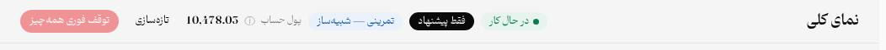

از راست به چپ:

| چیزی که می‌بینید | معنی |
|---|---|
| **نام صفحه** (مثلاً «نمای کلی») | الان کجای پنل هستید |
| 🟢 **در حال کار** | همه‌چیز عادی است |
| 🔴 **توقف اضطراری** | کلید توقف روشن است؛ هیچ معاملهٔ تازه‌ای باز نمی‌شود (بخش ۹) |
| 🔴 **متوقف شده** | ربات به‌خاطر یک مشکل جدی (مثلاً ۱۰٪ افت حساب) خودش را متوقف کرده |
| **فقط پیشنهاد** (یا تماشا / نیمه‌خودکار / کاملاً خودکار) | حالت کار ربات (بخش ۵) |
| **تمرینی — شبیه‌ساز** / **تمرینی — حساب دمو** / **پول واقعی** | روی چه حسابی کار می‌کند (بخش ۶) |
| **پول حساب** | موجودی به‌علاوهٔ سود و زیان معامله‌های باز |
| **تازه‌سازی** | عددها را همین حالا به‌روز می‌کند (خودش هم هر ۱۵ ثانیه به‌روز می‌شود) |
| **توقف فوری همه‌چیز** (قرمز) | کلید توقف اضطراری را روشن می‌کند. وقتی روشن است، جایش دکمهٔ **«برداشتن توقف اضطراری»** می‌آید |

### منوی سمت راست

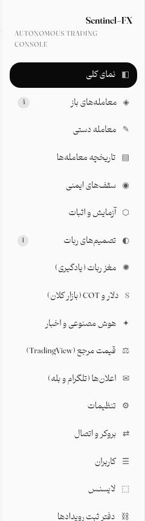

- هجده صفحه دارد که در بخش ۷ یکی‌یکی توضیح داده شده‌اند.
- **عدد کنار «معامله‌های باز»** یعنی چند **پیشنهاد معامله** منتظر تصمیم شماست.
- **عدد کنار «تصمیم‌های ربات»** یعنی ربات پیشنهاد داده یکی از **تنظیمات** عوض شود.
- **عدد کنار «مغز ربات»** یعنی یک «استراحت اجباری» فعال است.
- پایین منو: **روشن / تیره / سیستم** برای رنگ صفحه، و **شمارهٔ نسخه** (باید `v1.8.1` یا
  بالاتر باشد).

### علامت ⓘ

کنار تقریباً هر عدد و هر تنظیم یک **ⓘ** هست. موس را رویش ببرید (یا لمسش کنید) تا با یک
مثال ساده بگوید آن عدد یعنی چه. هر وقت چیزی را نفهمیدید، اول ⓘ را ببینید.

### نوارهای رنگی بالای صفحه

اگر اتفاق مهمی افتاده باشد، بالای هر صفحه یک نوار رنگی می‌آید:

| نوار | یعنی |
|---|---|
| 🔴 «توقف اضطراری روشن است» | دلیلش در همان نوار نوشته شده. بخش ۹ را ببینید |
| 🔴 «متاتریدر: ... » | اتصال به متاتریدر قطع است؛ نگهبان در حال وصل کردن دوباره است |
| 🟠 «استراحت اجباری» | بعد از چند ضرر پشت سر هم، ربات مدتی معاملهٔ تازه باز نمی‌کند |
| 🟠 «نگهبان عملکرد ... را معلق کرده» | یک استراتژی به‌خاطر ضرر مداوم کنار گذاشته شده |
| 🔴 «داده‌ها به‌روز نشدند» | پنل نتوانست اطلاعات تازه بگیرد. اگر `401` نوشته، F5 و ورود دوباره |

---

<a id="part-4"></a>

## ۴. چطور پیشنهاد معامله بگیرم؟ (مهم‌ترین بخش)

### اول بدانید «پیشنهاد» کجا می‌آید

پیشنهادهای معامله در صفحهٔ **«معامله‌های باز»** و در کارت **«معامله‌هایی که منتظر
تأیید شما هستند»** ظاهر می‌شوند. وقتی پیشنهادی بیاید، کنار «معامله‌های باز» در منو یک
**عدد** می‌بینید.

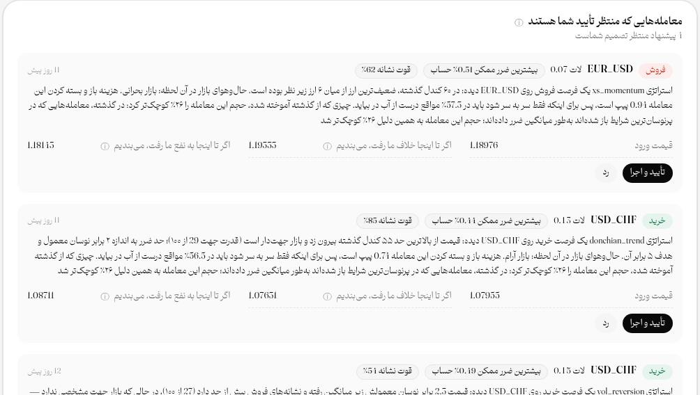

> ⚠️ **دو نوع «پیشنهاد» در پنل هست؛ قاطی نکنید:**
>
> - **پیشنهاد معامله** («خرید EUR_USD با این حد ضرر») → صفحهٔ **«معامله‌های باز»**.
> - **پیشنهاد تغییر تنظیمات** («فلان عدد را عوض کن») → صفحهٔ **«تصمیم‌های ربات»**، پایین
>   صفحه. این دومی فقط بعد از دست‌کم ۴۰ معاملهٔ بسته‌شده می‌آید.

### قدم‌به‌قدم، از صفر تا اولین پیشنهاد

**قدم ۱ — وارد شوید و به نوار بالا نگاه کنید.**
باید **«در حال کار»** (سبز) و **«فقط پیشنهاد»** را ببینید.

**قدم ۲ — اگر «توقف اضطراری» روشن است، خاموشش کنید.**
تا وقتی روشن است، **هیچ پیشنهادی نمی‌آید.** بالای صفحه دکمهٔ **«برداشتن توقف اضطراری»**
را بزنید ← کد شش‌رقمی ← «تأیید و اجرا». (دلیل روشن شدنش در نوار قرمز نوشته شده. اگر
`heartbeat` نوشته، یعنی ربات قبلاً مدتی خاموش بوده؛ با نسخهٔ ۱٫۸٫۱ این مشکل حل شده.)

**قدم ۳ — مطمئن شوید حالت ربات «فقط پیشنهاد» است.**
اگر نوار بالا «فقط تماشا» می‌گوید: **«تنظیمات»** ← **«رفتار ربات»** ← «حالت کار ربات» را
روی **«پیشنهاد»** بگذارید ← **«ذخیره تغییرات»** (بالای صفحه) ← کد.

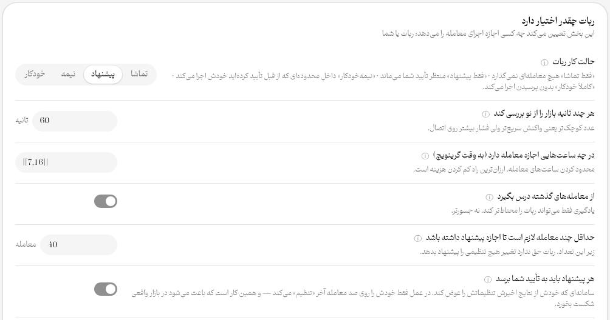

**قدم ۴ — (بسیار توصیه می‌شود) ربات را به حساب دموی آلپاری وصل کنید.**
تا وقتی نوار بالا **«تمرینی — شبیه‌ساز»** است، ربات روی **قیمت‌های ساختگی** کار می‌کند و
پیشنهادهایش **ربطی به بازار واقعی ندارد** (فقط برای یاد گرفتن کار با پنل خوب است). برای
پیشنهاد روی قیمت‌های واقعی، بخش ۶ را انجام دهید.

**قدم ۵ — صبر کنید. پیشنهادها «گاهی» می‌آیند، نه «مدام».**
این مهم‌ترین نکته است. ربات فقط وقتی پیشنهاد می‌دهد که **همهٔ** این شرط‌ها با هم درست
باشد:

- **روز کاری** باشد: دوشنبه تا جمعه (بازار فارکس آخر هفته بسته است).
- **ساعت مجاز** باشد: ساعت **۱۰:۳۰ تا ۱۹:۳۰ به وقت تهران**. بیرون این ساعت‌ها معامله گران‌تر
  است و ربات عمداً کاری نمی‌کند.
- یک **کندل ۴ ساعته** تمام شده باشد و شرط یکی از استراتژی‌ها برقرار شده باشد. هر ۴ ساعت
  فقط یک کندل تمام می‌شود، یعنی ربات در روز فقط **چند بار** فرصت تازه می‌بیند؛ بیشتر
  پیشنهادها کمی بعد از بسته شدن یک کندل ۴ ساعته، در ساعت‌های مجاز، ظاهر می‌شوند.
- **هیچ قاعدهٔ ایمنی** جلویش را نگرفته باشد (خبر مهم، اختلاف قیمت زیاد، سقف ضرر و ...).

یعنی **طبیعی است که یک یا چند روز هیچ پیشنهادی نیاید.** ربات عجله ندارد و نباید داشته
باشد.

**قدم ۶ — می‌خواهید بدانید ربات چه دیده و چرا پیشنهاد نداده؟**
به صفحهٔ **«تصمیم‌های ربات»** بروید. هر فرصتی که ربات دیده، **همراه دلیل** آنجاست؛ حتی
آن‌هایی که قواعد ایمنی جلویشان را گرفته‌اند (با برچسب قرمز «جلویش گرفته شد» و دلیل، مثلاً
«نزدیک یک خبر مهم اقتصادی بودیم»). اگر این صفحه هم خالی است، ربات هنوز فرصتی ندیده.

**قدم ۷ — (اختیاری) پیشنهادها را روی گوشی بگیرید.**
صفحهٔ **«اعلان‌ها (تلگرام و بله)»** را راه بیندازید و در «چه چیزهایی فرستاده شود» گزینهٔ
**«پیشنهادهای معامله»** را روشن کنید (به‌طور پیش‌فرض خاموش است). از آن به بعد، هر پیشنهاد
روی تلگرام یا بله هم می‌آید. **تأیید** همچنان فقط از پنل و با کد ممکن است.

### وقتی پیشنهاد آمد: چطور بخوانمش؟

هر پیشنهاد یک کارت است:

| چیزی که می‌بینید | معنی |
|---|---|
| **خرید** یا **فروش** و نام جفت‌ارز (مثلاً `EUR_USD`) | ربات می‌خواهد یورو را در برابر دلار بخرد یا بفروشد |
| **لات** (مثلاً `0.07`) | اندازهٔ معامله. ربات خودش حساب کرده |
| **بیشترین ضرر ممکن ۰٫۵٪ حساب** | اگر حد ضرر بخورد، همین درصد از حساب کم می‌شود |
| **قوت نشانه ۶۲٪** | چقدر شرایط با قاعدهٔ استراتژی جور است. **این احتمال سود نیست** |
| **متن توضیح** | ربات به فارسی می‌گوید چه دیده، حال‌وهوای بازار چه بوده، هزینهٔ معامله چقدر است و چرا حجم را کم کرده |
| **قیمت ورود** | قیمتی که معامله با آن باز می‌شود (تقریبی) |
| **اگر تا اینجا خلاف ما رفت، می‌بندیم** | **حد ضرر** |
| **اگر تا اینجا به نفع ما رفت، می‌بندیم** | **حد سود** |
| **چند روز پیش** | پیشنهاد چقدر قدیمی است. **پیشنهاد قدیمی را تأیید نکنید**؛ بازار عوض شده |

### تأیید یا رد

- **«تأیید و اجرا»** ← کد شش‌رقمی ← «تأیید و اجرا». ربات **یک بار دیگر** همهٔ قاعده‌ها را با
  قیمت همان لحظه بررسی می‌کند و بعد سفارش را می‌فرستد. معامله در جدول «معامله‌های باز» و در
  متاتریدر ظاهر می‌شود.
- اگر بعد از تأیید پیغام «رد شد» آمد، **طبیعی است**: یا بازار از لحظهٔ پیشنهاد تکان خورده، یا
  بیرون ساعت مجاز هستید، یا یک قاعدهٔ ایمنی تازه جلویش را گرفته.
- **«رد»** ← کد ← پیشنهاد حذف می‌شود و هیچ معامله‌ای انجام نمی‌شود.
- تصمیم **شما** و دلیلش هم در «دفتر ثبت رویدادها» می‌ماند.

### «چرا هیچ پیشنهادی نمی‌بینم؟» — به ترتیب بررسی کنید

| # | بررسی کنید | اگر این‌طور بود |
|---|---|---|
| ۱ | نوار بالا «**توقف اضطراری**» نشان می‌دهد؟ | «برداشتن توقف اضطراری» (قدم ۲) |
| ۲ | نوار بالا «**فقط تماشا**» است؟ | حالت را «پیشنهاد» کنید (قدم ۳). در حالت تماشا فرصت‌ها فقط در «تصمیم‌های ربات» دیده می‌شوند و قابل تأیید نیستند |
| ۳ | الان **آخر هفته** است یا ساعت **بیرون ۱۰:۳۰ تا ۱۹:۳۰** تهران؟ | صبر کنید |
| ۴ | نوار **«متاتریدر: ...»** یا **«استراحت اجباری»** یا **«معامله تازه ... متوقف است»** بالای صفحه هست؟ | دلیلش در همان نوار است؛ بخش ۹ |
| ۵ | در «تصمیم‌های ربات» با فیلتر **«جلوگیری‌شده»** فرصت‌هایی هست؟ | ربات فرصت دیده ولی قاعدهٔ ایمنی اجازه نداده؛ دلیل روی هر کارت نوشته شده. این یعنی ربات **درست** کار می‌کند |
| ۶ | «تصمیم‌های ربات» کاملاً خالی است؟ | هنوز هیچ کندل ۴ ساعته‌ای شرط استراتژی‌ها را برآورده نکرده. صبر کنید |
| ۷ | پیغام `401` می‌بینید؟ | F5 و ورود دوباره (عددها قدیمی مانده‌اند) |
| ۸ | «تنظیمات» ← «استراتژی‌ها»: استراتژی‌ها روشن‌اند؟ | باید سه استراتژی روشن ببینید |

### می‌خواهم خودم معامله کنم

صفحهٔ **«معامله دستی»** برای همین است (بخش ۷). همان قواعد ایمنی روی معاملهٔ شما هم اجرا
می‌شود.

---

<a id="part-5"></a>

## ۵. چهار حالت کار ربات

حالت ربات تعیین می‌کند **چه کسی** دکمهٔ نهایی را می‌زند. قواعد ایمنی در **هر چهار حالت**
کامل برقرارند.

| حالت | ربات چه می‌کند | کِی استفاده کنید |
|---|---|---|
| **فقط تماشا** | همه‌چیز را حساب می‌کند، **هیچ** پیشنهاد قابل تأییدی نمی‌دهد و هیچ معامله‌ای نمی‌کند | وقتی فقط می‌خواهید ببینید ربات چطور فکر می‌کند |
| **فقط پیشنهاد** ✅ (پیش‌فرض) | پیشنهاد می‌دهد و **منتظر تأیید شما** می‌ماند | **هفته‌ها و ماه‌های اول. از اینجا شروع کنید** |
| **نیمه‌خودکار** | معامله‌های **کوچک** روی `EUR_USD`، `GBP_USD` و `USD_JPY` (حداکثر ۰٫۲۰ لات و ۰٫۵٪ ریسک) را خودش انجام می‌دهد؛ بقیه را پیشنهاد می‌دهد | بعد از اینکه چند هفته پیشنهادها را دیده‌اید و منطقی بوده‌اند |
| **کاملاً خودکار** | همه را خودش انجام می‌دهد، بدون پرسیدن (ولی زیر همهٔ قواعد ایمنی) | فقط بعد از ماه‌ها تمرین روی دمو |

**عوض کردن حالت:** «تنظیمات» ← «رفتار ربات» ← «حالت کار ربات» ← «ذخیره تغییرات» ← کد.
فقط **مدیر** (`owner`) می‌تواند.

---

<a id="part-6"></a>

## ۶. شبیه‌ساز، دمو یا پول واقعی؟ و وصل کردن آلپاری

| برچسب در نوار بالا | یعنی | قیمت‌ها از کجا می‌آیند |
|---|---|---|
| **تمرینی — شبیه‌ساز** | حالت پیش‌فرض بعد از نصب. هیچ بروکری وصل نیست | **ساختگی**؛ داخل خود برنامه ساخته می‌شوند. فقط برای یاد گرفتن پنل |
| **تمرینی — حساب دمو** | به حساب دموی بروکر وصل است | **بازار واقعی**، پول غیرواقعی |
| **پول واقعی** | حساب واقعی | بازار واقعی، **پول واقعی** |

### وصل کردن حساب دموی آلپاری (خلاصه)

جزئیات کامل در فایل **`ALPARI-MT5-FA.html`** کنار همین راهنماست. خلاصه:

1. در سایت آلپاری یک حساب دموی **MetaTrader 5** بسازید (نه MetaTrader 4).
2. متاتریدر ۵ را باز کنید و وارد همان حساب دمو شوید. دکمهٔ **Algo Trading** را روشن کنید.
3. `Check-MT5.cmd` را اجرا کنید تا مطمئن شوید اتصال سالم است.
4. در پنل: **«بروکر و اتصال»** ← **«افزودن دستی»** ← پروفایل **Alpari** ← شمارهٔ حساب، نام سرور،
   **رمز معاملاتی** و مسیر متاتریدر (مثلاً `C:\Program Files\Alpari MT5\terminal64.exe`)
   ← **ذخیره**.
5. **«آزمایش اتصال»** ← کد. باید موجودی حساب دمو را ببینید. (آزمایش هیچ سفارشی
   نمی‌فرستد.)
6. **«فعال کن»** ← کد.
7. **کامپیوتر را یک بار Restart کنید** و دوباره وارد ویندوز شوید. ربات با ورود شما به
   ویندوز خودش روشن می‌شود. (عوض کردن بروکر عمداً فقط با راه‌اندازی دوباره اعمال
   می‌شود.) متاتریدر را هم باز کنید.
8. دوباره وارد پنل شوید. در «بروکر و اتصال»، پیغام «باید راه‌اندازی دوباره شود» دیگر نباید
   باشد، و **«پول حساب»** بالای صفحه باید با موجودی حساب دمو در متاتریدر یکی باشد.
   اگر «توقف اضطراری» روشن بود، برش دارید.

> **نکته:** برچسب «تمرینی — شبیه‌ساز» در نوار بالا فقط **نوع حساب اعلام‌شده** را نشان
> می‌دهد و بعد از وصل کردن دمو ممکن است همان بماند. ملاک اینکه واقعاً به آلپاری وصل
> هستید، **یکی بودن «پول حساب» با موجودی متاتریدر** است.

### پول واقعی

**عجله نکنید.** ربات فقط وقتی اجازهٔ معامله با پول واقعی می‌دهد که استراتژی‌ها
**آزمون‌های پذیرش** را گذرانده باشند. مسیر امن: چند هفته دمو ← آزمون پذیرش ← حساب واقعیِ
**سنتی (Cent)** با مبلغ کم ← یک **برداشت آزمایشی** از بروکر ← بعد بزرگ‌تر.

---

<a id="part-7"></a>

## ۷. صفحه‌به‌صفحه: همهٔ بخش‌های پنل

برای هر صفحه: **چه نشان می‌دهد**، **چه کاری آنجا می‌شود کرد**، و **به چه نگاه کنید**.

### ۷-۱. نمای کلی — صفحهٔ اول، هر روز

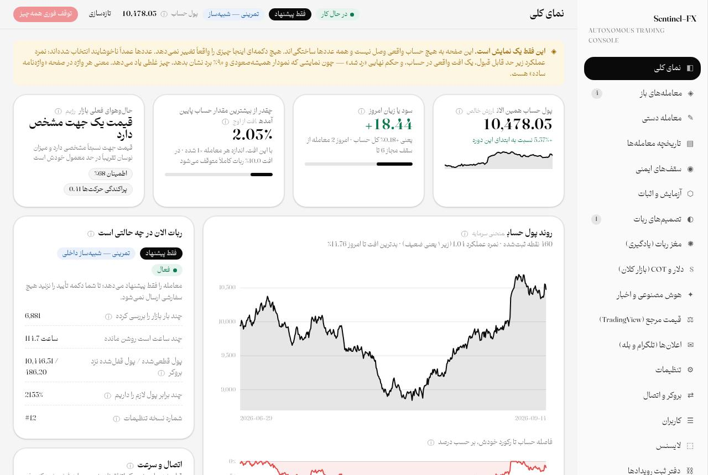

**چه نشان می‌دهد:**

- **پول حساب همین الان** و تغییرش از ابتدای دوره.
- **سود یا زیان امروز** و تعداد معامله‌های امروز از سقف مجاز.
- **چقدر از بیشترین مقدار حساب پایین آمده** (افت از اوج). هر چه بیشتر، ربات کوچک‌تر معامله
  می‌کند؛ در ۱۰٪ کاملاً می‌ایستد.
- **حال‌وهوای فعلی بازار** (جهت‌دار، آرام، پرنوسان، بحرانی).
- **روند پول حساب** (نمودار): شکل مسیر مهم‌تر از نقطهٔ آخر است.
- **ربات الان در چه حالتی است**، چند بار بازار را بررسی کرده، چند ساعت روشن مانده.
- **اتصال و سرعت**: چند درصد وقت به بروکر وصل بوده‌ایم و سرعت پاسخ.
- **معامله‌های باز**، **ربات با فرصت‌ها چه کرد** و **آخرین تصمیم‌ها**.

**به چه نگاه کنید:** پول حساب، سود/زیان امروز، و اینکه هیچ نوار قرمزی بالای صفحه نباشد.
اگر زیر یک معاملهٔ باز نوشته «حد ضرر نزد بروکر ثبت نشده»، جدی بگیرید.

### ۷-۲. معامله‌های باز — پیشنهادها اینجاست

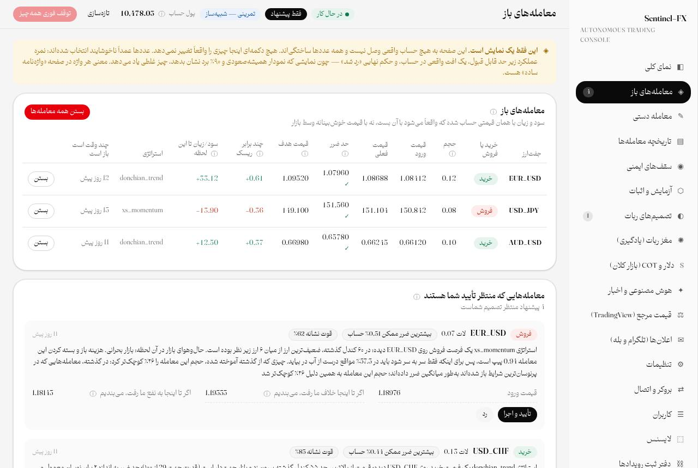

**سه کارت دارد:**

1. **معامله‌های باز:** جدول معامله‌هایی که هنوز بسته نشده‌اند: جفت‌ارز، خرید یا فروش،
   حجم، قیمت ورود، قیمت فعلی، **حد ضرر** (✓ سبز یعنی نزد بروکر ثبت شده)، قیمت هدف، نتیجه
   بر حسب «چند برابر ریسک» و سود/زیان تا این لحظه.
   - دکمهٔ **«بستن»** کنار هر معامله ← کد ← با قیمت بازار بسته می‌شود.
   - دکمهٔ قرمز **«بستن همه معامله‌ها»** ← کد ← همه بسته می‌شوند.
   - **بستن معامله هیچ‌وقت توسط قواعد ایمنی مسدود نمی‌شود.**
2. **معامله‌هایی که منتظر تأیید شما هستند:** پیشنهادهای ربات (بخش ۴).
3. **سفارش‌ها با چه کیفیتی اجرا می‌شوند:** چند سفارش رد شده، سرعت، و «لغزش» (چقدر بدتر از
   قیمت خواسته‌شده پر شده). برای شروع لازم نیست به این دقت کنید.

### ۷-۳. معامله دستی — معاملهٔ خودتان، با همان قواعد ایمنی

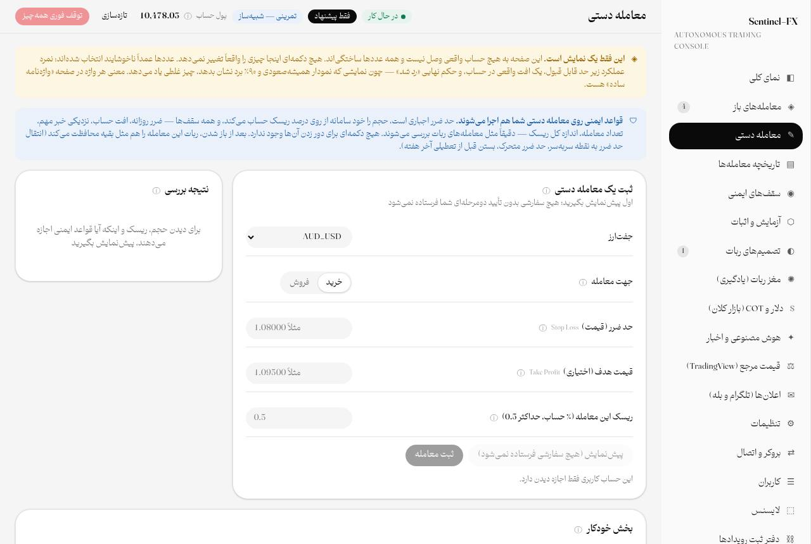

**قدم‌به‌قدم:**

1. **جفت‌ارز** را انتخاب کنید (مثلاً `EUR_USD`).
2. **جهت:** «خرید» اگر فکر می‌کنید قیمت بالا می‌رود، «فروش» اگر پایین می‌آید.
3. **حد ضرر (قیمت):** اجباری است. برای **خرید** باید **پایین‌تر** از قیمت فعلی باشد و برای
   **فروش** **بالاتر**. قیمت فعلی را از متاتریدر ببینید.
4. **قیمت هدف** (اختیاری) و **ریسک** (اختیاری؛ اگر خالی بماند همان ۰٫۵٪).
5. **«پیش‌نمایش»** را بزنید. **هیچ سفارشی فرستاده نمی‌شود**؛ فقط در کارت «نتیجه بررسی»
   می‌بینید حجم چقدر می‌شود، چند دلار در خطر است، و **قواعد ایمنی اجازه می‌دهند یا نه** (و
   اگر نه، چرا).
6. اگر سبز بود: **«ثبت معامله»** ← کد ← تأیید.

> **ترفند:** اگر قیمت فعلی را نمی‌دانید، یک حد ضرر تقریبی بگذارید و پیش‌نمایش بگیرید؛ در
> نتیجه «قیمت ورود تقریبی» را می‌بینید. بعد حد ضرر را درست کنید.

حجم را **شما** تعیین نمی‌کنید؛ سامانه از روی درصد ریسک و فاصلهٔ حد ضرر حساب می‌کند. این
عمدی است. معامله‌ای که باز شد، ربات مثل معامله‌های خودش از آن محافظت می‌کند. روی **پول
واقعی**، معاملهٔ دستی به‌طور پیش‌فرض خاموش است.

### ۷-۴. تاریخچه معامله‌ها

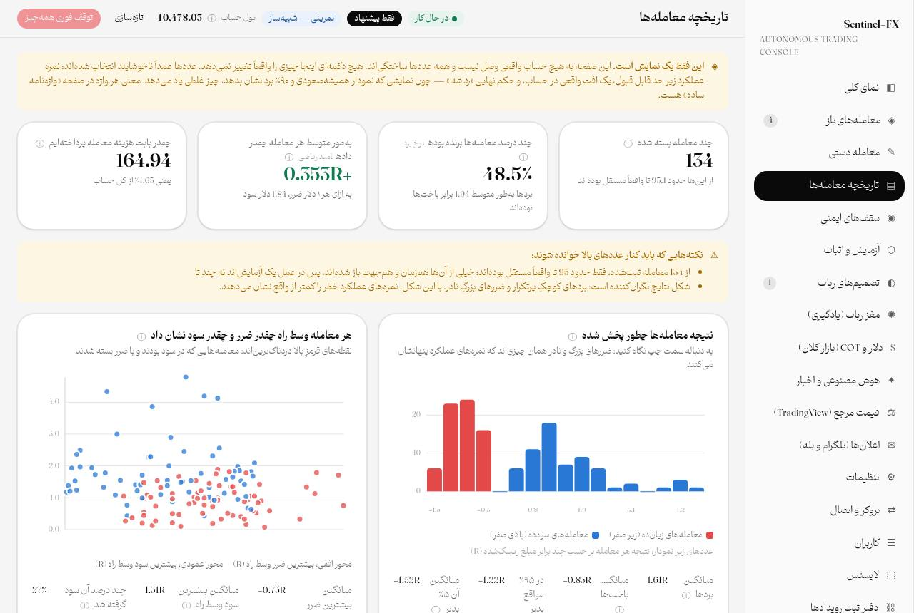

**چه نشان می‌دهد:** چند معامله بسته شده، چند درصد برنده بوده، به‌طور متوسط هر معامله
چقدر داده، چقدر هزینه پرداخته‌ایم، نتیجهٔ هر جفت‌ارز، معامله‌ها چطور تمام شده‌اند (حد ضرر،
حد سود، دستی ...) و **فهرست کامل معامله‌ها**.

**به چه نگاه کنید:** «به‌طور متوسط هر معامله چقدر داده» مهم‌تر از «درصد برد» است. ربات
می‌تواند ۴۰٪ برد داشته باشد و سودده باشد، یا ۷۰٪ برد و ضررده.

> ⚠️ **صادقانه:** جدول **«هر ماه چند درصد سود یا ضرر داشته»** در این نسخه عددهای **نمونه**
> نشان می‌دهد، نه عددهای حساب شما. بقیهٔ صفحه واقعی است.

### ۷-۵. سقف‌های ایمنی

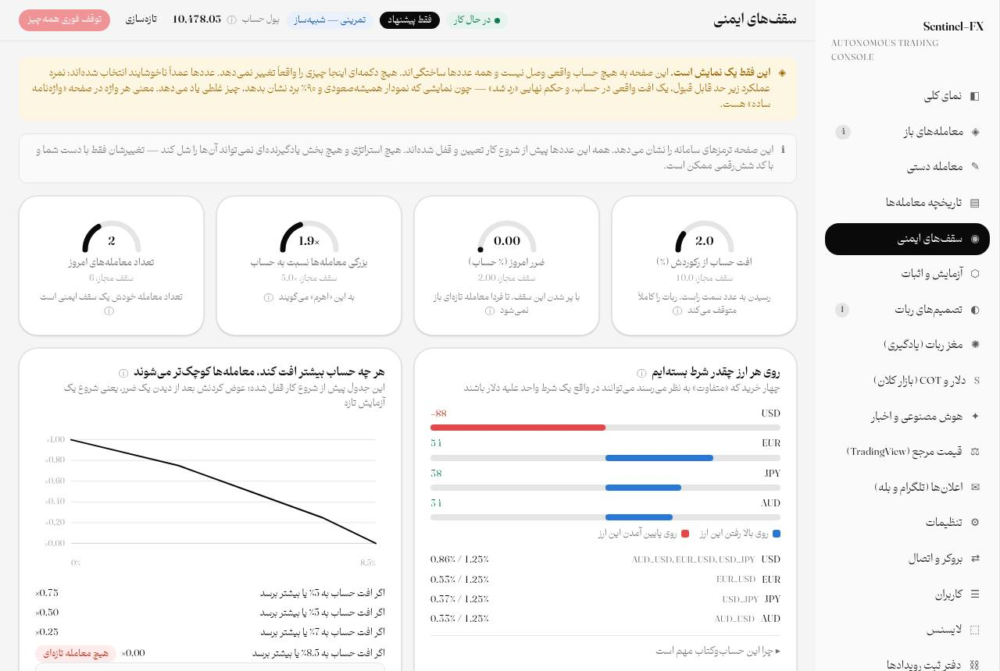

**چه نشان می‌دهد:**

- اگر یک سقف به حدش نزدیک شده باشد، بالای صفحه هشدار می‌دهد.
- **چهار عقربه:** افت حساب از رکوردش، ضرر امروز، بزرگی معامله‌ها نسبت به حساب، تعداد
  معامله‌های امروز؛ هرکدام با سقفش.
- **روی هر ارز چقدر شرط بسته‌ایم:** چهار معاملهٔ «متفاوت» می‌توانند در واقع یک شرط بزرگ
  روی دلار باشند.
- **جدول کوچک شدن معامله‌ها هنگام افت:** هر چه حساب بیشتر افت کند، معامله‌ها کوچک‌تر
  می‌شوند.
- **سقف‌هایی که همین حالا فعال‌اند** (ضرر روزانه ۲٪، هفتگی ۴٪، ماهانه ۶٪، توقف در ۱۰٪ افت
  و ...).
- دو جدول آموزشی: «برای سربه‌سر شدن چند درصد باید برنده باشید» و «برای هر فاصلهٔ حد ضرر
  حداقل چقدر سرمایه لازم است».

**کاری در این صفحه نمی‌شود کرد**؛ فقط دیدنی است. تغییر سقف‌ها در «تنظیمات» است.

### ۷-۶. آزمایش و اثبات

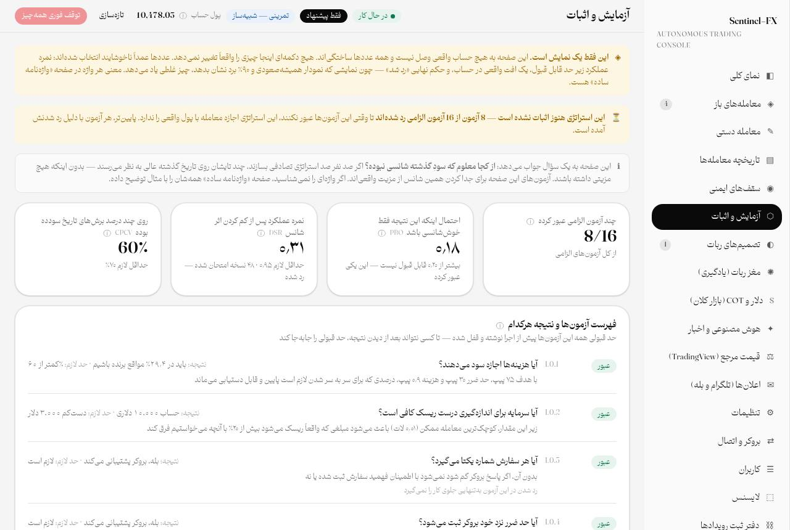

**چه نشان می‌دهد:** جواب این سؤال: «از کجا معلوم سودِ گذشتهٔ یک استراتژی شانسی نبوده؟»
فهرست آزمون‌های آماری، نتیجهٔ روی برش‌های مختلف تاریخ، و پایین صفحه **استراتژی‌ها و
مرحله‌ای که در آن هستند** (فقط یک ایده / در حال آزمایش / آزمون‌ها را گذرانده / کنار
گذاشته شده).

> ⚠️ **صادقانه:** بالای این صفحه (نتیجهٔ آزمون‌ها و عددهای PBO و DSR و نمودار برش‌ها) در این
> نسخه یک **نتیجهٔ نمونه** است و دربارهٔ استراتژی‌های شما نیست. بخش **«استراتژی‌ها و مرحله‌ای
> که در آن هستند»** واقعی است. اجرای آزمون پذیرش واقعی کار ماه‌های بعد است و فعلاً از خط
> فرمان انجام می‌شود.

### ۷-۷. تصمیم‌های ربات — «ربات چه دید و چرا؟»

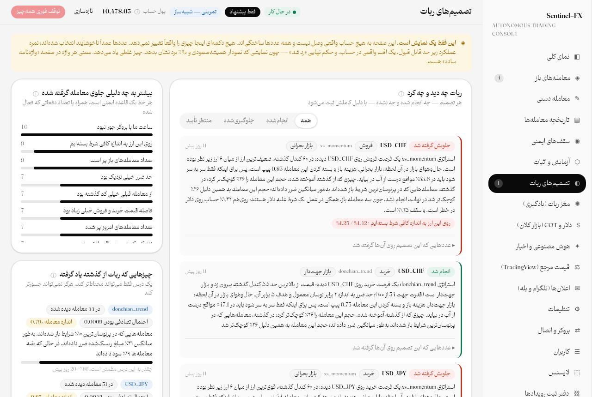

**مفیدترین صفحه برای یاد گرفتن طرز فکر ربات.**

- **ربات چه دید و چه کرد:** هر فرصتی که ربات دیده یک کارت دارد، با برچسب **«انجام شد»**
  (سبز)، **«جلویش گرفته شد»** (قرمز) یا **«منتظر تأیید»** (نارنجی) و **توضیح کامل** به
  فارسی. برچسب‌های قرمز زیر کارت می‌گویند کدام قاعده جلویش را گرفته. با دکمه‌های بالای کارت
  فیلتر کنید: همه / انجام‌شده / جلوگیری‌شده / منتظر تأیید.
- «عددهایی که این تصمیم روی آن‌ها گرفته شد»: کلیک کنید تا جزئیات را ببینید.
- **بیشتر به چه دلیلی جلوی معامله گرفته شده:** نمودار قاعده‌هایی که بیشتر از همه فعال
  شده‌اند.
- **چیزهایی که ربات از گذشته یاد گرفته:** درس‌ها. هر درس فقط می‌تواند حجم را **کوچک‌تر** کند.
- **تغییرهایی که ربات پیشنهاد داده:** پیشنهاد تغییر تنظیمات (بعد از ۴۰ معامله). دکمهٔ
  «بفرست برای آزمایش» فوراً چیزی را عوض نمی‌کند؛ اول آزمایش می‌شود.
- اگر **نگهبان عملکرد** استراتژی‌ای را معلق کرده باشد، اینجا دکمهٔ «آزاد کردن» دارد. فقط
  وقتی آزادش کنید که علت ضررها را فهمیده‌اید.

> اگر اینجا کارت‌های قرمز زیادی می‌بینید، **خبر خوبی است**: یعنی قواعد ایمنی کار
> می‌کنند. ربات عمداً بیشتر «نه» می‌گوید تا «بله».

### ۷-۸. مغز ربات (یادگیری)

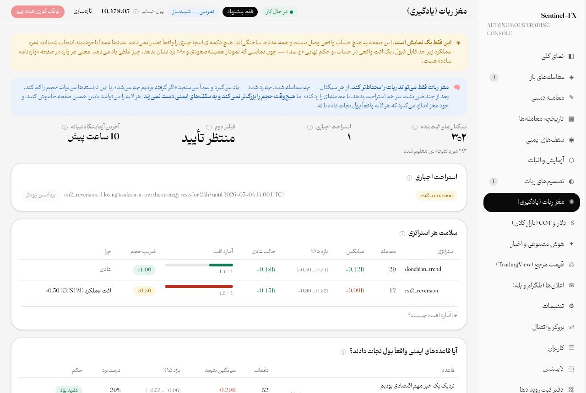

**چه نشان می‌دهد:**

- **سیگنال‌های ثبت‌شده:** ربات همهٔ سیگنال‌ها را، چه معامله شده باشند چه نه، در یک «دفتر
  سایه» نگه می‌دارد و بعداً می‌سنجد «اگر گرفته بودیم چه می‌شد».
- **استراحت اجباری:** بعد از چند ضرر پشت سر هم، کل حساب یا یک استراتژی مدتی استراحت
  می‌کند. دکمهٔ «برداشتن زودتر» دارد (توصیه نمی‌شود).
- **سلامت هر استراتژی:** زنده / ضعیف / مرده / دادهٔ کم. اگر نتیجهٔ واقعی یک استراتژی از
  انتظار پایین‌تر برود، حجمش کم می‌شود.
- **آیا قاعده‌های ایمنی واقعاً پول نجات دادند؟** برای هر فیلتر می‌سنجد جلوگیری‌هایش به نفع
  بوده یا به ضرر.
- **فیلتر دوم:** مدلی که روی هر سیگنال نظر می‌دهد. تا وقتی آموزش ندیده و تأیید نشده، اثری
  ندارد.
- **آزمایشگاه شبانه:** هر شب استراتژی‌ها را دوباره می‌آزماید (دکمهٔ «اجرای همین حالا» هم
  دارد).
- **گزارش هفتگی** و **تنظیمات مغز ربات** (بعد از چند ضرر استراحت کند، چقدر، و «بدترین
  سناریو»).

**برای شروع:** هفته‌ای یک بار نگاهی بیندازید. لازم نیست چیزی را عوض کنید.

### ۷-۹. دلار و COT (بازار کلان)

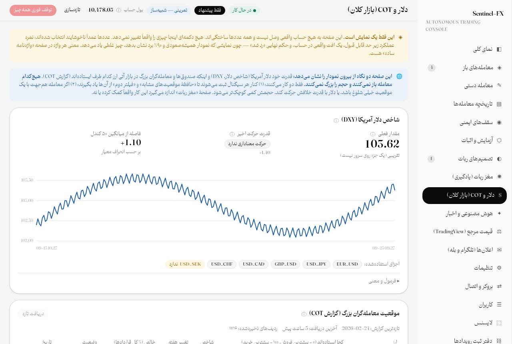

**چه نشان می‌دهد:**

- **شاخص دلار آمریکا (DXY):** قدرت دلار در برابر شش ارز اصلی، که ربات از قیمت‌های بروکر
  خودتان می‌سازد. اگر دلار قوی خلاف معامله حرکت کند («باد مخالف»)، حجم کم می‌شود. اگر
  بعضی از جفت‌ارزهای لازم روی سرور بروکر نباشد، صفحه همین را می‌گوید و شاخص ساخته نمی‌شود.
- **گزارش COT:** گزارش هفتگی دولت آمریکا (CFTC) که می‌گوید صندوق‌های بزرگ در بازار آتی هر
  ارز کدام طرف ایستاده‌اند. اگر بیش از حد یک طرف «شلوغ» شده باشد، حجم کم می‌شود. با دکمهٔ
  «دریافت تازه» به‌روز می‌شود.

**هیچ‌کدام معامله باز نمی‌کنند یا حجم را بزرگ نمی‌کنند.** اگر دریافت COT خطا داد (مثلاً
دسترسی به سایت CFTC بسته بود)، مهم نیست؛ ربات بدون آن هم کامل کار می‌کند.

### ۷-۱۰. هوش مصنوعی و اخبار (اختیاری)

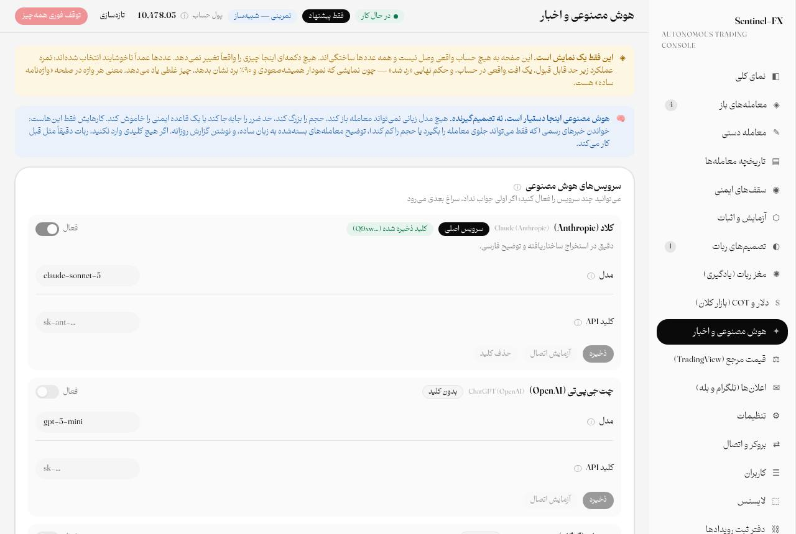

**هوش مصنوعی اینجا دستیار است، نه تصمیم‌گیرنده.** هیچ مدلی نمی‌تواند معامله باز کند، حجم را
بزرگ کند یا قاعده‌ای را خاموش کند.

- **سرویس‌های هوش مصنوعی:** اگر کلید API یک سرویس (Claude، OpenAI، Gemini، Kimi، DeepSeek)
  را دارید، اینجا وارد کنید ← «آزمایش اتصال». کلید رمزنگاری‌شده نگه داشته می‌شود و دیگر
  نشان داده نمی‌شود. **بدون هوش مصنوعی هم ربات کامل کار می‌کند.**
- **گزارش روزانهٔ بازار:** خلاصهٔ بازار و خبرهای پیش‌رو به فارسی («ساخت گزارش تازه»).
- **مربی:** بعد از هر معاملهٔ بسته‌شده توضیح می‌دهد چه شد (ورود دیر، خروج زود، بدشانسی و
  ...).
- **اخبار رسمی و تقویم اقتصادی:** خبرهای بانک‌های مرکزی و زمان خبرهای مهم. ربات نزدیک
  خبرهای مهم معامله نمی‌کند.
- **Jev:** خبرخوان داخلی. به‌طور پیش‌فرض در حالت **«سایه»** است: فقط نظرش را ثبت می‌کند و
  هیچ اثری روی معامله ندارد.

### ۷-۱۱. قیمت مرجع (TradingView) (اختیاری)

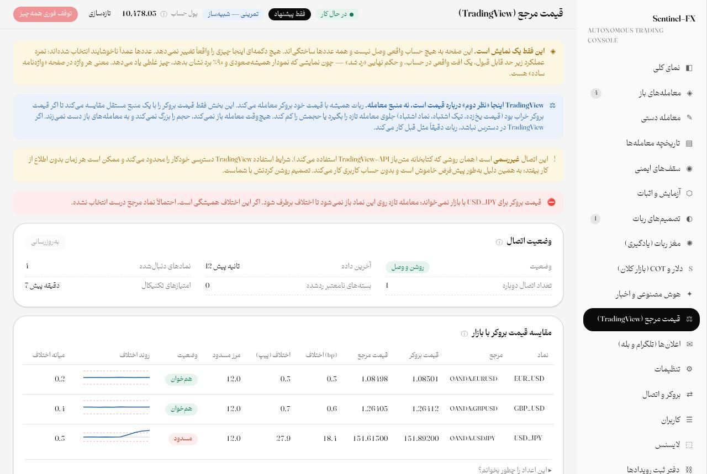

قیمت‌های بروکر شما را با قیمت‌های **TradingView** مقایسه می‌کند. اگر بروکر قیمت عجیبی
بدهد (اختلاف زیاد)، ربات حجم را کم می‌کند یا معامله نمی‌کند. «امتیاز تحلیل تکنیکال»
TradingView هم فقط برای نمایش است. اگر این صفحه به TradingView وصل نشد، مهم نیست.

### ۷-۱۲. اعلان‌ها (تلگرام و بله)

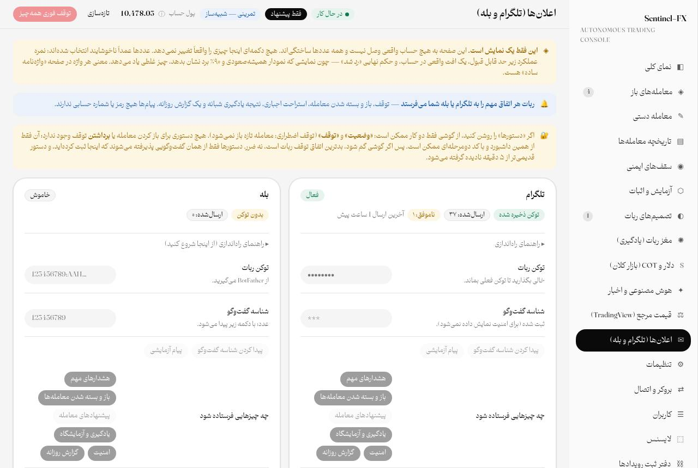

هر اتفاق مهم (توقف، باز و بسته شدن معامله، استراحت اجباری، گزارش روزانه و ...) را به
**تلگرام** یا **بله** می‌فرستد. پیام‌ها هیچ رمز یا شمارهٔ حسابی ندارند.

**راه‌اندازی (راهنمای کامل در خود صفحه، «راهنمای راه‌اندازی»):**

1. در تلگرام با `@BotFather` (یا در بله با بات‌فادر بله) یک ربات بسازید و **توکن** را کپی
   کنید.
2. توکن را در کارت همان پیام‌رسان بگذارید.
3. به ربات خودتان در پیام‌رسان یک پیام بدهید (Start)، بعد در پنل **«پیدا کردن شناسه
   گفت‌وگو»**.
4. در «چه چیزهایی فرستاده شود» موارد دلخواه را تیک بزنید. **برای گرفتن پیشنهادها، «پیشنهادهای
   معامله» را روشن کنید.**
5. «فعال» ← «ذخیره» ← کد ← **«پیام آزمایشی»**.

**«دستورها از گوشی»:** اگر روشن کنید، از گوشی فقط دو کار ممکن است: **«وضعیت»** و
**«توقف»** (توقف اضطراری). باز کردن معامله یا برداشتن توقف از گوشی **ممکن نیست**.

اگر تلگرام روی کامپیوتر ربات کار نمی‌کند، **بله** را امتحان کنید. ساعت گزارش روزانه به وقت
جهانی (UTC) است؛ پنل معادل تهرانش را هم نشان می‌دهد.

### ۷-۱۳. تنظیمات

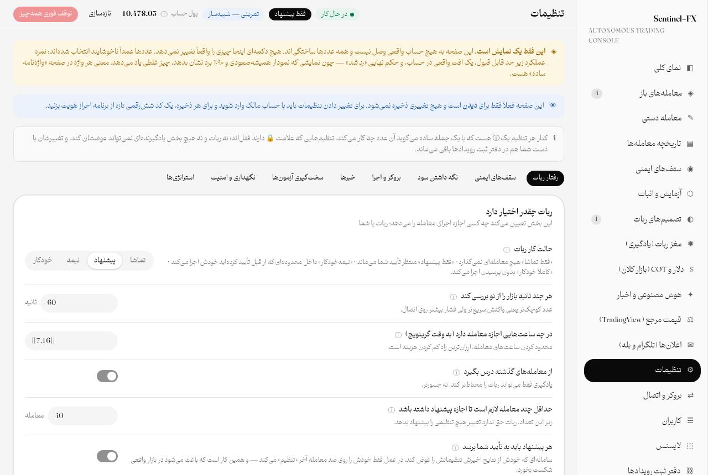

هشت بخش دارد (دکمه‌های بالای صفحه):

| بخش | چه چیزی را تعیین می‌کند |
|---|---|
| **رفتار ربات** | **حالت کار ربات**، هر چند ثانیه بازار را بررسی کند، **ساعت‌های مجاز معامله** (به وقت گرینویچ؛ `[[7,16]]` یعنی ۱۰:۳۰ تا ۱۹:۳۰ تهران)، یادگیری |
| **سقف‌های ایمنی** | ریسک هر معامله، سقف ضرر روزانه، هفتگی و ماهانه، افت توقف، فاصلهٔ حد ضرر، تعداد معامله، رفتار نزدیک خبر، بستن آخر هفته |
| **نگه داشتن سود** | حد ضرر به نقطهٔ ورود، بستن بخشی از سود، حد ضرر دنبال‌کننده، توقف بعد از سود روزانه |
| **بروکر و اجرا** | نوع حساب و بروکر (فقط نمایش)، ارز حساب، لغزش مجاز، ... |
| **خبرها** | خبرها در نظر گرفته شوند، نقش خبر، خواندن خبر با هوش مصنوعی |
| **سخت‌گیری آزمون‌ها** | حدهای قبولی آزمون‌های آماری. **دست نزنید** |
| **نگهداری و امنیت** | نگهبان ضربان، زمان اعتبار ورود (۳۰ دقیقه)، ... |
| **استراتژی‌ها** | کدام استراتژی روشن است، روی چه جفت‌ارزهایی، و در چه مرحله‌ای |

**چطور چیزی را عوض کنم:** مقدار را تغییر دهید ← بالای صفحه **«ذخیره تغییرات»** ← فهرست
تغییرها را ببینید ← کد. اگر حتی یک مقدار با بقیه ناسازگار باشد، **هیچ‌کدام** اعمال نمی‌شود.

- تنظیم‌های **🔒** قفل‌اند: ربات و هیچ بخش یادگیرنده‌ای نمی‌تواند عوضشان کند؛ فقط شما، با
  کد.
- **توصیهٔ جدی:** در ماه‌های اول به «سقف‌های ایمنی» و «سخت‌گیری آزمون‌ها» دست نزنید.
  **هیچ‌وقت بعد از یک ضرر، سقف‌ها را شل نکنید.**

### ۷-۱۴. بروکر و اتصال

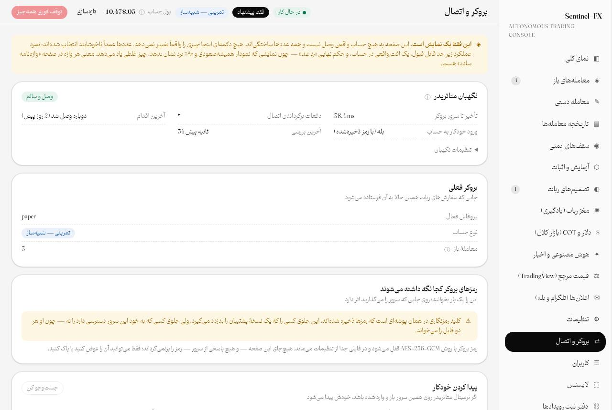

- **نگهبان متاتریدر:** وضعیت متاتریدر (وصل و سالم / بسته است / به سرور وصل نیست / وارد
  حساب نشده / روی حساب دیگری است) و تنظیمات نگهبانی که آن را دوباره باز و وصل می‌کند.
- **بروکر فعلی:** پروفایل فعال، نوع حساب، تعداد معاملهٔ باز. اگر نوشته «باید راه‌اندازی
  دوباره شود»، کامپیوتر را Restart کنید (بخش ۶).
- **رمزهای بروکر کجا نگه داشته می‌شوند:** یک بار بخوانید.
- **پیدا کردن خودکار:** اگر متاتریدر روی همین کامپیوتر باز و وارد حساب باشد، با
  دکمهٔ **«جست‌وجو کن»** خودش پیدا می‌شود.
- **بروکرهای ذخیره‌شده:** برای هر اتصال: **«آزمایش اتصال»** (بی‌خطر، هیچ سفارشی نمی‌فرستد)،
  **«ویرایش»**، **«فعال کن»** (فقط بعد از آزمایش موفق) و **«حذف»**. اتصال تازه را با **«افزودن
  دستی»** بسازید.
- **بروکرهایی که سامانه می‌شناسد:** Alpari، AMarkets و «هر بروکر متاتریدر ۵».

**قدم‌ها برای وصل شدن:** بخش ۶.

### ۷-۱۵. کاربران

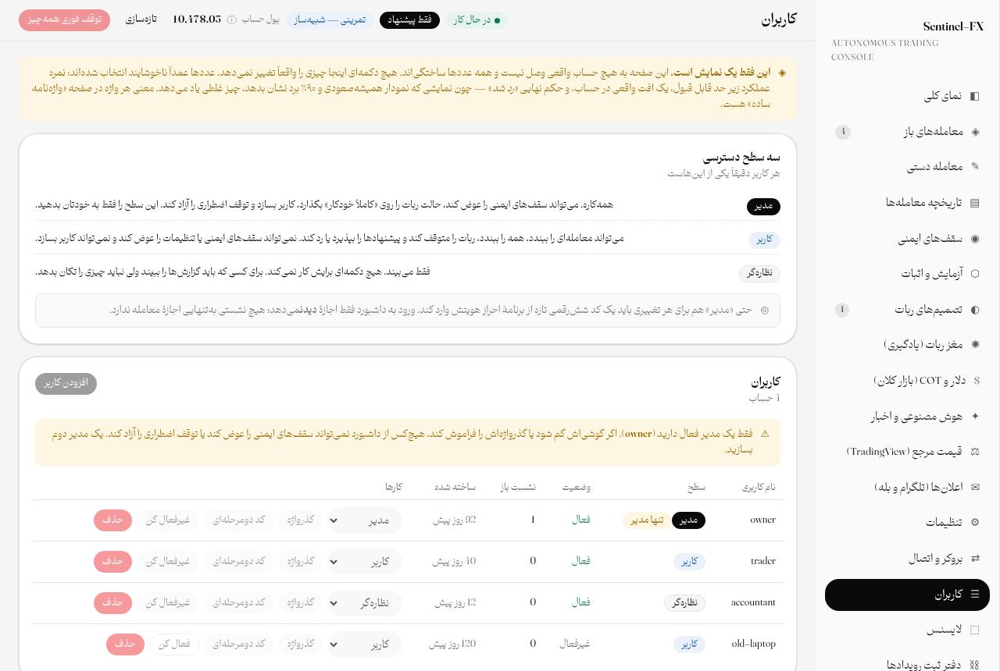

سه سطح دسترسی:

| سطح | چه کاری می‌تواند بکند |
|---|---|
| **مدیر** (`owner`) | همه‌کاره: تنظیمات، حالت ربات، ساختن کاربر، برداشتن توقف اضطراری |
| **کاربر** | تأیید و رد پیشنهادها، بستن معامله، روشن کردن توقف — ولی نه تغییر تنظیمات |
| **نظاره‌گر** | فقط می‌بیند |

- **«افزودن کاربر»**: برای کسی که می‌خواهد فقط ببیند، «نظاره‌گر» بسازید.
- **«گذرواژه»**: عوض کردن رمز یک کاربر.
- ⚠️ **دکمهٔ «کد دومرحله‌ای» را فقط وقتی بزنید که گوشی گم شده.** کلید دومرحله‌ای تازه
  می‌سازد و کلید فعلی گوشی را **باطل** می‌کند.
- آخرین مدیر فعال را نمی‌شود حذف یا غیرفعال کرد.

### ۷-۱۶. لایسنس

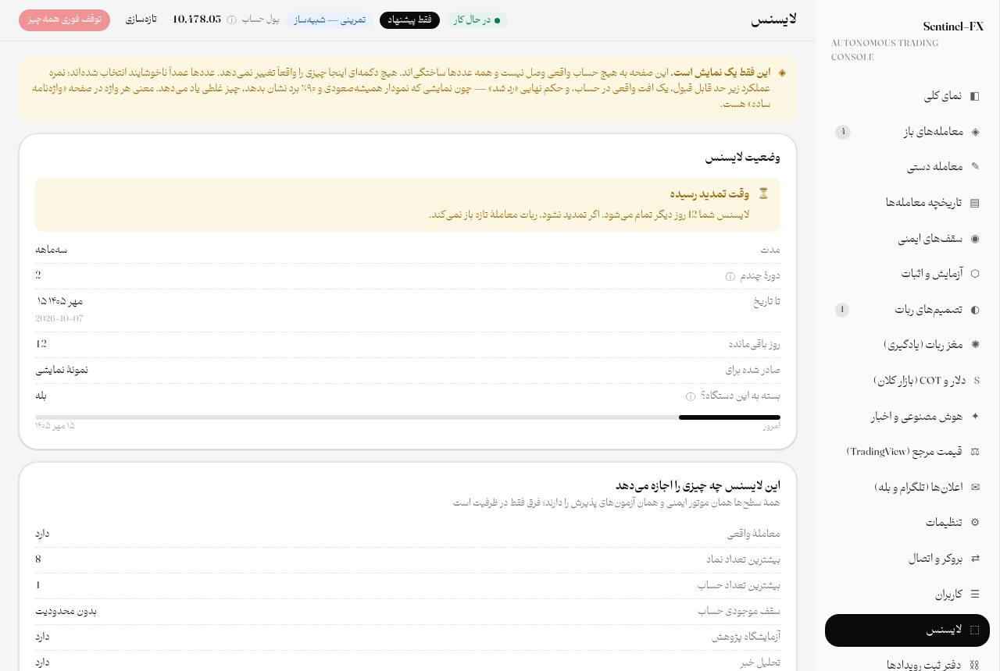

وضعیت لایسنس، تاریخ پایان و اینکه چه چیزهایی مجاز است. اگر نوشته **«این نسخه قفل لایسنس
ندارد»**، کاری لازم نیست. اگر لایسنس تمام شود، **معامله‌های باز رها نمی‌شوند**؛ فقط معاملهٔ
تازه باز نمی‌شود.

### ۷-۱۷. دفتر ثبت رویدادها

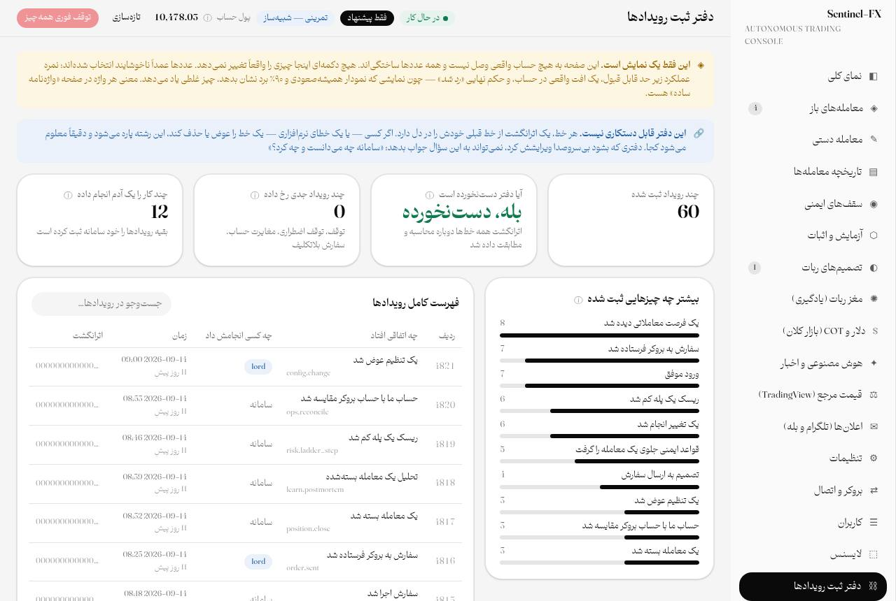

هر اتفاقی که افتاده (ورود، تغییر تنظیم، سفارش، توقف، تأیید پیشنهاد و ...) با زمان و اینکه
**چه کسی** انجامش داده ثبت می‌شود. «آیا دفتر دست‌نخورده است» باید **سالم** باشد. وقتی
می‌خواهید بدانید «چه کسی و کِی این کار را کرد؟»، اینجا را ببینید.

### ۷-۱۸. واژه‌نامهٔ ساده

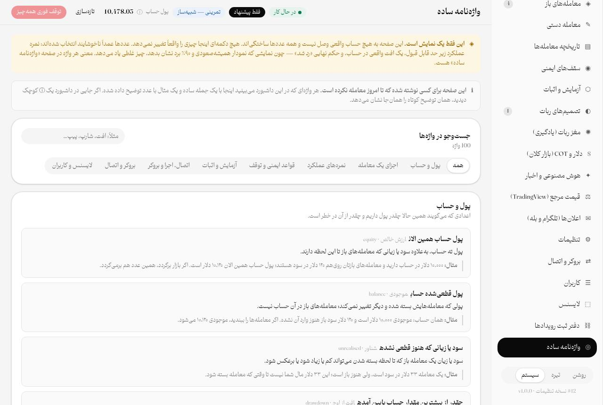

معنی همهٔ واژه‌های پنل با **مثال عددی**. هر واژه‌ای را نفهمیدید، اینجا را ببینید.

---

<a id="part-8"></a>

## ۸. کارهای روزانه و هفتگی

**هر روز (۵ دقیقه):**

1. متاتریدر باز است و وارد حساب دموست؟
2. پنل ← **«نمای کلی»**: نوار بالا «در حال کار» است؟ نوار قرمزی نیست؟
3. **«معامله‌های باز»**: پیشنهاد تازه‌ای هست؟ بخوانید و تصمیم بگیرید. همهٔ معامله‌های باز
   **✓ سبز** کنار حد ضرر دارند؟
4. **«تصمیم‌های ربات»**: امروز چه دیده و چرا؟ (بهترین راه یاد گرفتن)

**هر هفته (۱۵ دقیقه):**

1. **«تاریخچه معامله‌ها»**: متوسط نتیجهٔ هر معامله مثبت است یا منفی؟
2. **«مغز ربات»**: سلامت استراتژی‌ها و گزارش هفتگی.
3. `Diagnose.cmd` را یک بار اجرا کنید.

**پشتیبان‌گیری** خودکار است (هر شب ساعت ۳:۳۰).

**توقف فوری، حتی بدون پنل و بدون اینترنت:** روی `Kill-Switch.cmd` (در پوشهٔ
`deploy\windows`) دوبار کلیک کنید.

---

<a id="part-9"></a>

## ۹. مشکلات رایج و راه حل

| مشکل | علت | راه حل |
|---|---|---|
| `401: invalid or expired session` | ۳۰ دقیقهٔ ورود تمام شده، یا ربات دوباره روشن شده | **F5** و ورود دوباره |
| «نام کاربری یا گذرواژه نادرست است، یا حساب موقتاً قفل شده» | رمز اشتباه، یا ۵ اشتباه پشت سر هم | زبان صفحه‌کلید را **انگلیسی** کنید (Alt+Shift) و Caps Lock را خاموش. اگر قفل است ۱۵ دقیقه صبر کنید |
| کد شش‌رقمی قبول نمی‌شود (`invalid code`) | ساعت گوشی یا کامپیوتر درست نیست | ساعت هر دو را «خودکار» کنید؛ دستورهای ساعت در راهنمای ویندوز (قدم ۰) |
| `this code has already been used` | این کد قبلاً استفاده شده | ۳۰ ثانیه صبر کنید تا کد عوض شود |
| نوار «**توقف اضطراری**» | کسی کلید را زده، یا ربات مدتی جواب نداده (`heartbeat`) | اگر علت برطرف شده: «برداشتن توقف اضطراری» ← کد. از ویندوز: `Kill-Switch.ps1 -Release` |
| نوار «**متوقف شده**» | یک سقف جدی رد شده (مثلاً ۱۰٪ افت) یا حساب ربات با بروکر نمی‌خواند | دلیل در نوار قرمز نوشته شده. در این نسخه دکمه‌ای برای ادامه در پنل نیست؛ به کسی که ربات را نصب کرده خبر بدهید |
| نوار «**متاتریدر: ...**» | متاتریدر بسته، قفل یا قطع است | متاتریدر را باز کنید و وارد حساب شوید؛ نگهبان هم خودش تلاش می‌کند |
| هیچ پیشنهادی نمی‌آید | بخش ۴، جدول «چرا هیچ پیشنهادی نمی‌بینم؟» | |
| پیشنهاد را تأیید کردم ولی «رد شد» | بازار تکان خورده، بیرون ساعت مجاز، یا قاعدهٔ تازه | طبیعی است؛ منتظر پیشنهاد بعدی بمانید |
| پیشنهاد خیلی قدیمی است | پیشنهادها تا تصمیم شما می‌مانند | «رد» کنید؛ پیشنهاد کهنه را تأیید نکنید |
| پنل باز نمی‌شود (`127.0.0.1:8088`) | موتور ربات خاموش است | `Diagnose.cmd` را اجرا کنید |
| بعد از فعال کردن آلپاری، هنوز قیمت‌ها ساختگی است | ربات دوباره راه‌اندازی نشده | کامپیوتر را Restart کنید (بخش ۶) |

**برای کمک گرفتن**، این را اجرا کنید و فایل زیپی را که می‌سازد بفرستید (هیچ رمزی داخلش
نیست):

```
powershell -ExecutionPolicy Bypass -File C:\SentinelFX\app\deploy\windows\Diagnose.ps1 -Bundle
```

---

<a id="part-10"></a>

## ۱۰. چند واژهٔ ضروری

| واژه | معنی ساده |
|---|---|
| **جفت‌ارز** | دو ارز در برابر هم. `EUR_USD` یعنی یورو در برابر دلار |
| **خرید / فروش** | خرید یعنی امید دارید قیمت بالا برود؛ فروش یعنی پایین بیاید |
| **پیپ** | کوچک‌ترین پلهٔ معمول حرکت قیمت. در `EUR_USD` یعنی ۰٫۰۰۰۱ |
| **لات** | اندازهٔ معامله. در ۰٫۱۰ لات، هر پیپ حدود ۱ دلار سود یا زیان است |
| **حد ضرر (Stop Loss)** | قیمتی که اگر بازار خلاف شما رفت، معامله خودکار بسته می‌شود |
| **حد سود (Take Profit)** | قیمتی که اگر بازار به نفع شما رفت، معامله با سود بسته می‌شود |
| **ریسک هر معامله** | اگر حد ضرر بخورد چند درصد حساب کم می‌شود (پیش‌فرض ۰٫۵٪) |
| **R** | «چند برابر مبلغ ریسک‌شده». اگر ۵ دلار ریسک کرده‌اید، ‎+۲R یعنی ۱۰ دلار سود |
| **افت از اوج** | فاصلهٔ پول حساب تا بالاترین مقداری که تا حالا داشته |
| **اسپرد** | فاصلهٔ قیمت خرید و فروش؛ هزینهٔ هر معامله |
| **کندل ۴ ساعته (H4)** | هر شمع نمودار، ۴ ساعت قیمت را خلاصه می‌کند |
| **حساب دمو** | حساب تمرینی بروکر با پول غیرواقعی ولی قیمت‌های واقعی |
| **حساب سنتی (Cent)** | حساب واقعی که موجودی را به سنت نشان می‌دهد؛ برای سرمایهٔ کم مناسب است |

بقیهٔ واژه‌ها: صفحهٔ **«واژه‌نامه ساده»** در خود پنل.

---

<a id="part-11"></a>

## ۱۱. کارهایی که هرگز نباید بکنید

- ❌ **با پول واقعی شروع نکنید.** اول چند هفته دمو و «فقط پیشنهاد».
- ❌ **بعد از ضرر، سقف‌های ایمنی را شل نکنید.** این دقیقاً همان کاری است که حساب‌ها را خالی
  می‌کند.
- ❌ **ریسک هر معامله را بالا نبرید.** طبق شبیه‌سازی خود ربات، برای استراتژی‌ای که برتری
  واقعی ندارد، احتمال اینکه حساب در یک سال ۲۰٪ افت کند با ریسک ۲٪ حدود **۹۳٪** است و با
  ریسک ۰٫۵٪ حدود **۳٪**.
- ❌ **پیشنهاد قدیمی را کورکورانه تأیید نکنید.** توضیحش را بخوانید.
- ❌ **دکمهٔ «کد دومرحله‌ای» در صفحهٔ کاربران را بی‌دلیل نزنید.**
- ❌ **پوشهٔ `C:\ProgramData\SentinelFX` را پاک نکنید.** حافظه، حساب‌ها و تاریخچهٔ ربات آنجاست.
- ❌ **پولی را که به آن نیاز دارید وارد نکنید.**

> **حرف آخر:** این ربات قرار نیست «ماهی ۳۰٪ سود» بدهد؛ هر کسی چنین قولی بدهد یا ریسک
> دیوانه‌وار می‌کند یا دروغ می‌گوید. کار این ربات این است که **زود و ارزان** بفهمد یک
> استراتژی واقعاً کار می‌کند یا نه، و در این مدت **سرمایهٔ شما را حفظ کند**. صبور باشید.
